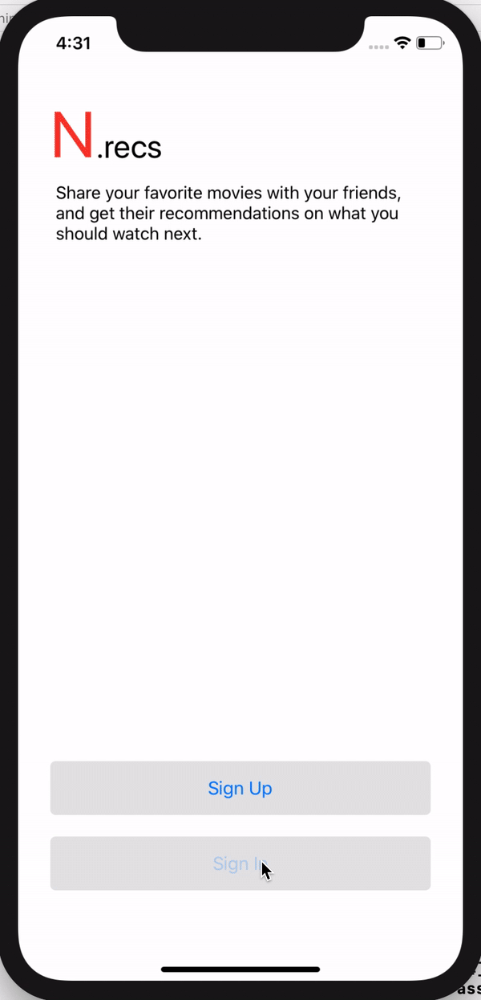
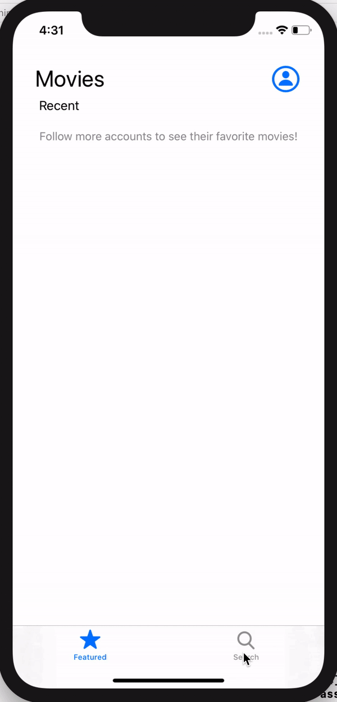
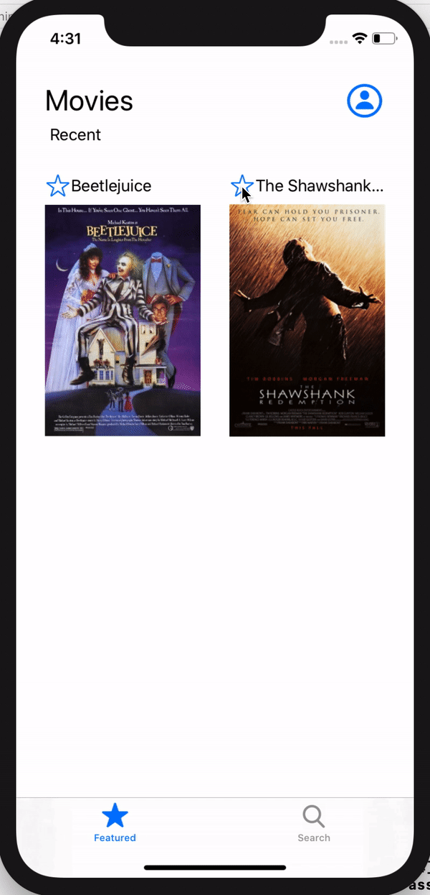

# N.recs

An iOS app where you can get recommendations from your friends on what movies to watch next

## Feature Demos

Accounts feature:

Favoriting shows feature:

Following friends feature:

Other features:

## How to use the app

Sign in/sign up and you will be taken the home page. This shows you all the movies that have been favorited by the people you follow, but not those that you have favorited as well. The icon on the top right shows you your account details including the movies you’ve favorited. You can click the star by the movie to favorite/unfavorite it. Also, you can click on the movie poster to get a description of it, and some more details. You can also search for movies and accounts. These accounts can be followed/unfollowed, and your homepage should update accordingly. The pull to refresh feature can also be used on your homepage.

## Description of the project

I had intended for this project to be a way that people can favorite tv shows and then share those with their friends, and similarly, see their friends’ favorite shows. I was having trouble getting the tv show apis that I found to work, so I decided to import a JSON file with a list of shows into my Firebase database. Unfortunately, I wasn’t able to find any files that were JSON formatted lists of tv shows, so I decided to use movies for the meantime. All the features are the same as what I had intended for them to be. Currently, my code refers to the app as having tv shows because that is the intention. However, for the meantime, I have changed the UILabels on the storyboard to match the data - e.g., My Shows became My Movies. 

## Goals

I think from here, I will look more into tv show apis or possibly switch to just using movies altogether. Either way, I think it would be best if I could get a Netflix or IMDB api working. Also, I didn’t implement user profile pictures. I added the gesture features that allow you to choose images from your Photos Library but commented that out, mostly because I wasn’t able to figure out how to store that in the database in time. Also, I was thinking of adding a feature to the tv show details screen, which would show all of the people you follow that have favorited that particular show. 
